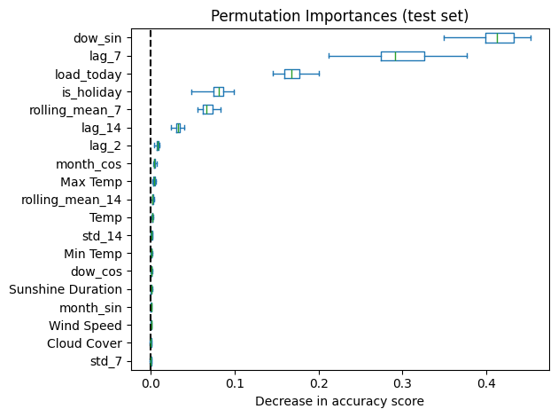
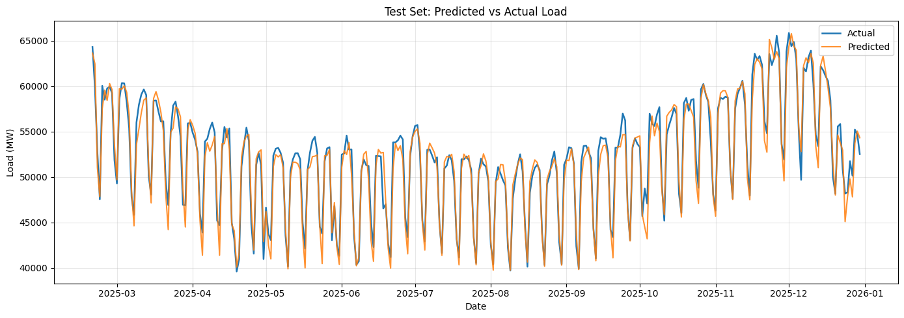

# Time Series Energy Prediction

Forecast day-ahead electricity load using weather, calendar context, and historical load signals.

This repository combines:
- Data collection from ENTSO-E (load) and Meteostat (weather)
- Feature engineering for classical ML and deep learning
- Model training notebooks for Random Forest, XGBoost, and LSTM

## What This Project Does

The pipeline builds a daily dataset and predicts next-day load.

1. Pull load time series from ENTSO-E.
2. Pull weather for multiple German cities and average to national-level weather indicators.
3. Engineer lag, rolling, and calendar features.
4. Train and evaluate models on chronological splits:
	- Train: 2018-2023
	- Validation: 2024
	- Test: 2025

## Repository Structure

- data/ : cached parquet splits and artifacts
- models/ : trained model files and scaler
- utils/get_features.py : data acquisition and feature engineering
- utils/data_preparation.py : split, scaling, dataset preparation
- utils/visualize_model_performance.py : evaluation plots and metrics
- training_ML_models.ipynb : Random Forest and XGBoost workflow
- training_DL_models.ipynb : LSTM workflow

## Installation

```bash
python3.11 -m venv .venv
source .venv/bin/activate
python -m pip install --upgrade pip
pip install -r requirements.txt
```

### Lightweight install hint

The current requirements.txt includes many notebook-related packages because it was generated from a full environment snapshot.

Optional: install core packages manually:

```bash
pip install pandas numpy scikit-learn xgboost torch meteostat entsoe-py holidays python-dotenv matplotlib seaborn joblib fastparquet
```

Then add any missing package if your notebook reports ImportError.

## API Key Setup

This project expects an ENTSO-E API key in an environment variable.

Create a .env file in the project root:

```env
ENTSOE_API_KEY=your_key_here
```

Notes:
- The loader searches for .env in the project root and current working directory.
- You can also pass api_key directly to data functions.

## Feature Engineering (Current)

### Load features

Generated in utils/get_features.py:

- load_today: daily average load for current day
- lag_2: previous day load (shifted by 1)
- lag_7: target-day-aligned weekly lag (shifted by 6)
- lag_14: target-day-aligned biweekly lag (shifted by 13)
- lag_30: target-day-aligned monthly lag (shifted by 29)
- rolling_mean_7, rolling_mean_14, rolling_mean_30
- std_7, std_14, std_30
- load_prediction: target, next-day load

### Weather features

Averaged across selected cities (configured in the notebook call):

- Temp
- Min Temp
- Max Temp
- Wind Speed
- Sunshine Duration
- Cloud Cover

### Calendar features

- is_holiday: Germany-wide holidays
- dow_sin, dow_cos: Cyclical encoded day of the week
- month_sin, month_cos: Cyclical encoded month

When align_calendar_to_target_day=True (default in the matching function), calendar features are shifted so row t uses calendar context for target day t+1.

### Feature Importance Analysis

Feature importance was estimated using permutation importance with the trained Random Forest forecaster on the 2025 test dataset. Features with larger performance drops are more influential for day-ahead load prediction.




## Data Preparation

utils/data_preparation.py does the following:

- Loads or regenerates train/validation/test parquet files
- Builds feature matrix and target vector from selected columns
- Fits StandardScaler only on training features listed in SCALE_FEATURES
- Applies the same scaler to validation and test
- Saves scaler to models/feature_scaler.joblib

## Training Workflows

### Classical ML

Open training_ML_models.ipynb and run cells in order.

Models:
- RandomForestRegressor
- XGBRegressor

### Deep Learning

Open training_DL_models.ipynb and run cells in order.

Model:
- LSTMForecaster (windowed sequence input)

## Results

### LSTM Forecaster
This plot shows the predicted next-day load for the 2025 test dataset using the trained LSTM forecaster:



